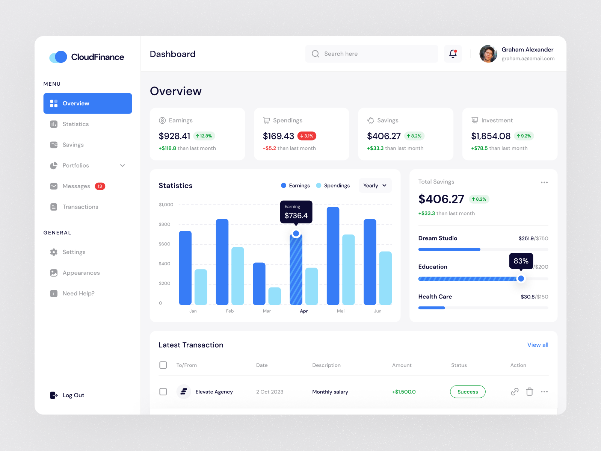

# Cloud Finance App UI

App UI for Cloud Finance Web App designed by [Muhammad Izza Recka Putra](https://dribbble.com/Adhiari_ishttps://dribbble.com/muhammadizza) available on [Dribbble](https://dribbble.com/shots/22909091-Cloud-Finance-Financial-Management-Dashboard-UI) recreated in Flutter by [Maruf Hassan](https://github.com/zyllus17)

## Table of Contents

- [Design](#design)
- [Contact me](#contact-me)
- [Support me](#support-me)
- [License](#license)

## Design

## Contact me

## Support me

My work is free and I don't like hiding my work behind a paywall like others so that everyone can benefit from it and open source community can grow and prosper with it.

If you like my work and can support me to make more open source UI designs then do consider supporting me. 

### UPI

Indians can use any UPI app to support me.

### Card/Paypal

Everyone else can help me using Ko-fi

## License

- **[MIT license](https://github.com/zyllus17/cloud-/blob/master/LICENSE)**

